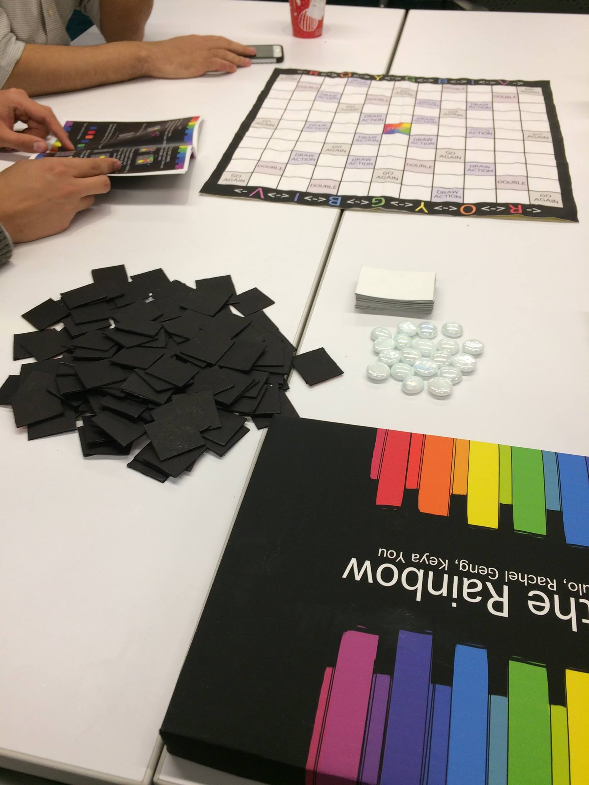
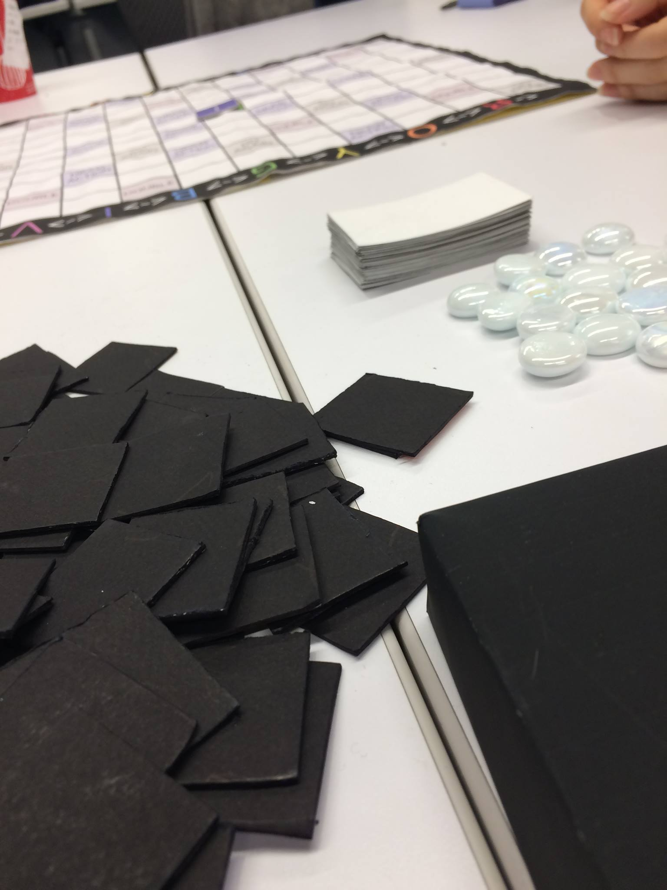
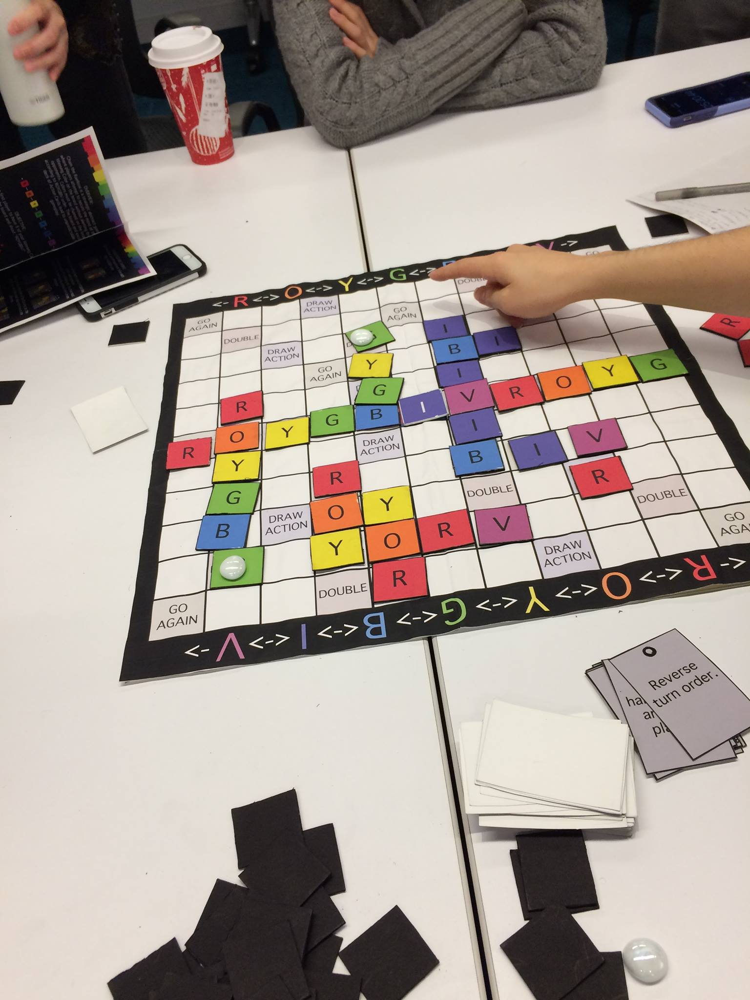
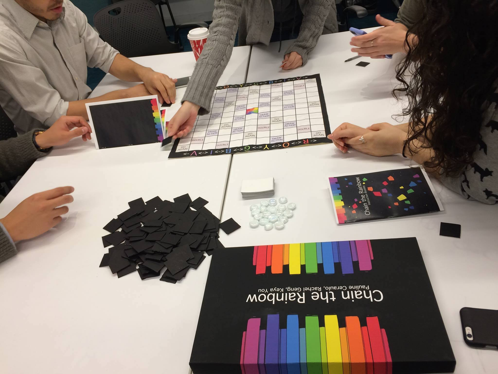

# Chain-the-Rainbow
Game prototype details for final project of Intro to Game Design (Fall 2016). Completed in a team of 3 with Keya You and Rachel Geng. 

Chain the Rainbow is a strategic abstract game where players attempt to secure the most of their
Winning Color on the board without alerting their opponents. Colors must be chained on the board according to ROYGBIV order. The board and exciting deck of Action Cards lead to unpredictable gameplay.

Rules can be viewed here: <a href="Rulebook.pdf"> rules </a>(graphics done by Rachel Geng)

Sample Images Compiled from team members:
<ul>
	<li></li>
	<li></li>
	<li></li>
	<li></li>
</ul>
